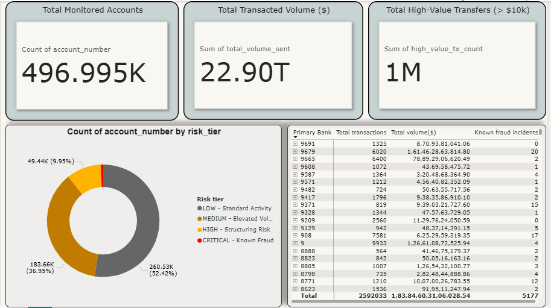

# Enterprise AML & Financial Fraud Analytics Platform

## 📌 Project Overview
An end-to-end Data Engineering and Analytics pipeline designed to process, store, and analyze 5 million international banking transactions. The platform identifies Anti-Money Laundering (AML) risks and visualizes structural fraud patterns for executive review.

## 🛠️ Architecture & Tech Stack
* **Extraction & Validation (Python/Pandas):** Programmatic ingestion of raw CSVs via chunking to manage memory, applying strict data typing and null-value handling.
* **Data Warehousing (PostgreSQL):** Transitioned flat transaction logs into a highly indexed Star Schema (Fact & Dimension tables) via high-speed bulk `COPY` commands.
* **Transformation & Business Logic (SQL):** Built an aggregated Data Mart computing account-level risk tiers based on transaction velocity and high-value transfer thresholds (> $10k).
* **Visualization (Power BI):** An interactive executive command center connected directly to the SQL Data Mart for zero-latency drill-throughs.

## 🚀 The Pipeline Flow
1. `extract_validate.py`: Cleans raw data and generates a validated staging file.
2. `load_staging.py`: Streams 5 million records into the PostgreSQL staging area in under 80 seconds.
3. `02_create_star_schema.sql` & `03_populate.sql`: Normalizes the data into a dimensional model.
4. `04_create_risk_mart.sql`: Executes the risk-scoring engine.

## 📊 Dashboard Preview

## 💡 Key Business Insight
The pipeline successfully isolated a narrow segment of accounts flagged as 'CRITICAL' and 'HIGH' risk, protecting over $22 Trillion in transacted volume while filtering out 88% of low-risk noise for fraud investigators.
